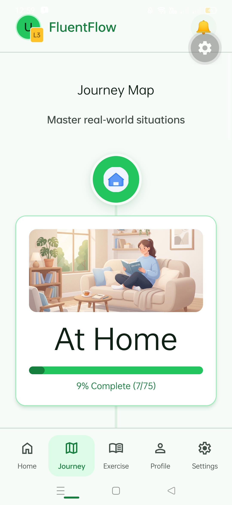
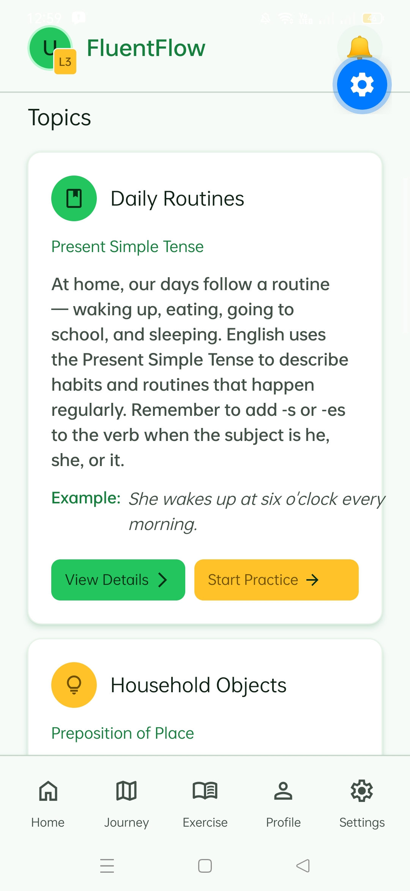
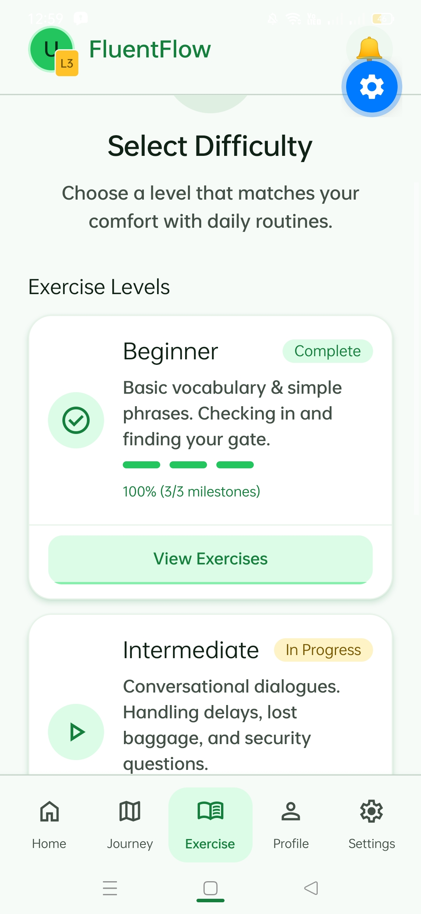
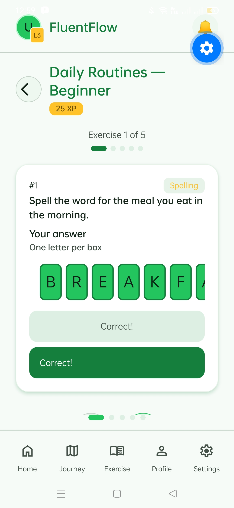
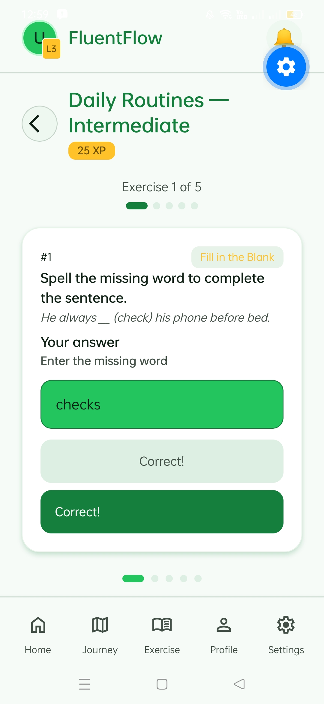
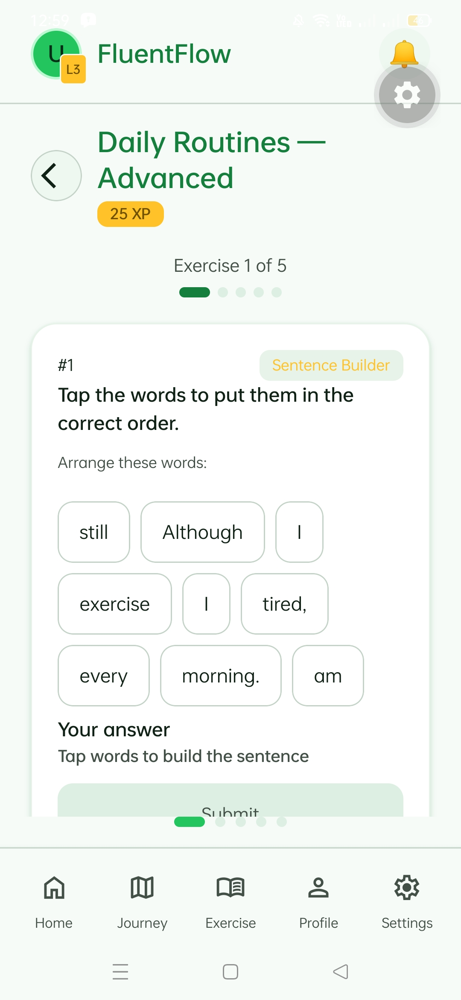

# FluentFlow

**FluentFlow** is a situational English learning app built with React Native and Expo. It helps users master practical English vocabulary and grammar through real-world scenarios, interactive exercises, and spaced-repetition-style progress tracking.

---

## 📱 App Screenshots

| Main Page | Journey Map | Topic View |
|-----------|-------------|------------|
|  |  |  |

| Level Selection | Beginner Exercises | Intermediate Exercises |
|-----------------|---------------------|------------------------|
|  |  |  |

| Advanced Exercises |
|---------------------|
|  |

---

## 🎯 Objectives & Purpose

### Core Mission
FluentFlow bridges the gap between textbook English and real-world communication by teaching vocabulary **in context** — not as isolated word lists, but within the situations where they're actually used.

### Learning Philosophy
- **Situational Learning**: 6 journeys covering everyday scenarios (Home, School, Restaurant, Coffee Shop, Market, Store)
- **Progressive Difficulty**: 3 levels per topic — Beginner → Intermediate → Advanced
- **Active Recall**: Three exercise types that force production, not passive recognition
- **Visible Progress**: Journey map with completion percentages, exercise-level tracking, and XP rewards

### Target Users
- ESL/EFL learners who want practical, usable English
- Self-study learners needing structure without a classroom
- Anyone preparing for real-world English interactions (travel, work, daily life)

---

## ✨ Key Features

### 1. Journey Map (Situational Curriculum)
- **6 real-world journeys**: At Home, At School, At Restaurant, At Coffee Shop, At Market, At Store
- **Locked progression**: Complete previous journeys to unlock the next
- **Visual progress tracking**: Circular nodes with completion %, progress bars, and status badges

### 2. Topic-Based Lessons
- Each journey contains multiple topics with specific grammar focus
- Expandable topic cards show:
  - Grammar focus (e.g., "Present Simple for Routines", "Polite Requests with Modals")
  - Intro text with example sentences
  - Vocabulary list with definitions, parts of speech, and contextual examples

### 3. Three Exercise Types
| Type | Description | Interaction |
|------|-------------|-------------|
| **Spelling** | Type the word letter-by-letter | Per-letter input boxes with auto-focus navigation |
| **Fill in the Blank** | Complete sentences with missing words | Text input with contextual hints |
| **Sentence Builder** | Reorder shuffled words into correct sentences | Drag-tap word chips to build sentences |

### 4. Exercise Session Flow
- Shows one exercise at a time with animated progress indicator
- **Animated progress dots**: Smooth transitions (150–250ms) showing completed → active → pending states
- Navigation via arrow buttons or swipe
- Immediate feedback with "Correct!" / "Incorrect" banners
- Review mode for retrying only incorrect exercises

### 5. Progress & Gamification
- **XP system**: Earn XP per correct exercise
- **Accuracy tracking**: Percentage of correctly answered exercises
- **Journey completion**: Visual mastery indicators
- **Review Mistakes mode**: Focus practice on weak areas

### 6. Offline-First Architecture
- SQLite database via `expo-sqlite` for local persistence
- All exercises, answers, and progress stored locally
- No account required to start learning

---

## 🛠 Technology Stack

### Core Framework
| Technology | Version | Purpose |
|------------|---------|---------|
| **Expo** | ~57.0.13 | Managed workflow, file-based routing (expo-router) |
| **React Native** | 0.86.2 | Cross-platform native UI |
| **React** | 19.2.3 | Component framework with React Compiler enabled |
| **TypeScript** | ~6.0.3 | Type-safe development |

### Navigation & Routing
| Technology | Version | Purpose |
|------------|---------|---------|
| **expo-router** | ~57.0.13 | File-based navigation with typed routes |
| **react-native-screens** | ~4.26.0 | Native screen primitives |
| **react-native-safe-area-context** | ~5.7.0 | Safe area insets |

### Animation & Gesture
| Technology | Version | Purpose |
|------------|---------|---------|
| **react-native-reanimated** | 4.5.1 | Declarative native animations (progress dots, exercise transitions, onboarding blobs) |
| **react-native-gesture-handler** | ~2.32.0 | Touch handling for interactive exercises |

### Data & Storage
| Technology | Version | Purpose |
|------------|---------|---------|
| **expo-sqlite** | ~57.0.1 | Local SQLite database (journeys, topics, vocabulary, exercises, user progress) |
| **expo-constants** | ~57.0.11 | App config access |

### UI & Styling
| Technology | Version | Purpose |
|------------|---------|---------|
| **expo-symbols** | ~57.0.2 | Platform-native SF Symbols / Material Icons |
| **expo-font** | ~57.0.1 | Custom font loading (Quicksand via @expo-google-fonts/quicksand) |
| **expo-image** | ~57.0.3 | Optimized image loading |
| **expo-glass-effect** | ~57.0.1 | Glassmorphism visual effects |

### Theming
- **Custom theming system** (`useTheme`, `ThemedText`, `ThemedView`) with Material You–inspired color tokens
- Light/dark mode support via `userInterfaceStyle: "automatic"`

### Developer Experience
| Tool | Purpose |
|------|---------|
| **ESLint** | `eslint-config-expo` with React Hooks rules |
| **TypeScript** | Strict mode, path aliases (`@/` → `src/`) |
| **Expo dev client** | Native debugging |

---

## 📂 Project Structure

```
src/
├── app/                      # Expo Router pages (file-based routing)
│   ├── (tabs)/               # Tab navigator screens
│   │   ├── header.tsx        # App header with avatar, XP, notifications
│   │   └── navBar.tsx        # Bottom navigation
│   ├── pages/
│   │   ├── journey.tsx       # Journey map with progress tracking
│   │   ├── topic.tsx         # Topic list with vocabulary expansion
│   │   ├── exercise-list.tsx # Level selection + exercise carousel
│   │   ├── exercise-session.tsx # Single-exercise practice mode
│   │   ├── login.tsx         # User authentication
│   │   └── setting.tsx       # App settings
│   ├── index.tsx             # Splash → redirect to login
│   └── OnboardingScreen.tsx  # Animated onboarding
├── components/
│   ├── exercise/
│   │   ├── SpellingExercise.tsx         # Animated letter boxes (scale/opacity)
│   │   ├── SentenceBuilderExercise.tsx  # Word chip reordering
│   │   ├── FillBlankExercise.tsx        # Text input with hints
│   │   └── ExerciseProgressIndicator.tsx # Animated progress dots (new)
│   ├── themed-text.tsx       # Typography wrapper with theme colors
│   ├── themed-view.tsx       # View wrapper with theme background
│   ├── screen-motion.tsx     # Page transition wrapper
│   └── ...
├── backend/                  # Database query functions (modular, one per table)
│   ├── Journey.ts
│   ├── Topic.ts
│   ├── TopicExercise.ts
│   ├── ExerciseTokens.ts
│   ├── ExerciseAnswer.ts
│   ├── UserProfile.ts
│   └── ...
├── database/
│   └── database.ts           # SQLite connection + schema init
├── contexts/
│   └── theme-context.tsx     # React Context for light/dark theme
├── constants/
│   └── theme.ts              # Color tokens, spacing, typography scale
├── hooks/
│   └── use-theme.ts          # Theme hook
└── data/
    └── seed-exercises.js     # Development seed data
```

---

## 🚀 Getting Started

### Prerequisites
- Node.js 18+
- npm / yarn / pnpm
- Expo CLI: `npm install -g expo-cli`
- iOS Simulator (Mac) or Android Studio for emulators

### Installation

```bash
# Clone the repo
git clone <repository-url>
cd FluentFlow

# Install dependencies
npm install

# Start development server
npm start
```

### Run on Platforms

```bash
# iOS Simulator
npm run ios

# Android Emulator
npm run android

# Web
npm run web

# Development build (required for some native modules)
npx expo run:android
npx expo run:ios
```

### Database

The SQLite database initializes automatically on first launch with:
- 6 journeys (situational scenarios)
- Topics per journey with grammar focus
- Vocabulary with definitions & examples
- Exercises across 3 levels × 3 types per topic
- User profile & progress tables

---

## 🧪 Development Commands

```bash
# Lint (Expo's ESLint config + React Hooks rules)
npm run lint

# Type-check
npx tsc --noEmit

# Reset project to starter template
npm run reset-project
```

---

## 📄 License

This project is private and proprietary. All rights reserved.

---

## 🤝 Contributing

Internal project — see team guidelines for contribution workflow.

---

**Built with ❤️ using Expo & React Native**